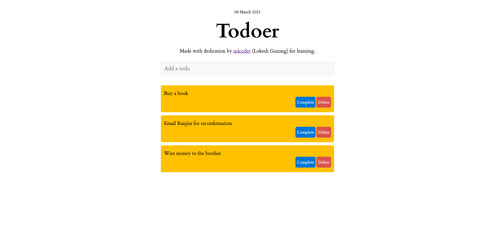

# Todoer 

An app where you can add a task to do, mark it completed or delete it

## Demo
[https://8gu34.csb.app/](https://8gu34.csb.app/)

## What I Changed:
- Redesigned the interface 
- Added responsiveness
- Inserted date 

## Acknowledgements:
Digital Ocean tutorial ["How To Build a React To-Do App with React Hooks"](https://www.digitalocean.com/community/tutorials/how-to-build-a-react-to-do-app-with-react-hooks) by Kapehe Jorgenson.

This project was bootstrapped with [Create React App](https://github.com/facebook/create-react-app).

