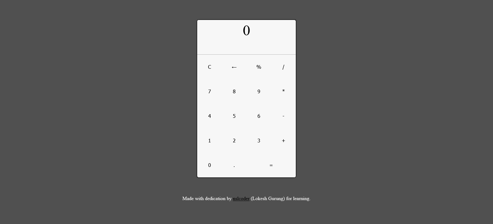

# React Calculator

A simple React calculator that can add, subtract, multiply, divide and calculate percentage.

## Demo
[https://r8hv1.csb.app/](https://r8hv1.csb.app/)

## What I Changed:
- Added my own CSS styles
- Removed the LargeButton component and its related code in other components

## Acknowledgements:
Journal tutorial ["Everything React — Calculator App!"](https://blog.usejournal.com/everything-react-first-app-188b33a880ca) by Danyal Imran.

This project was bootstrapped with [Create React App](https://github.com/facebook/create-react-app).

